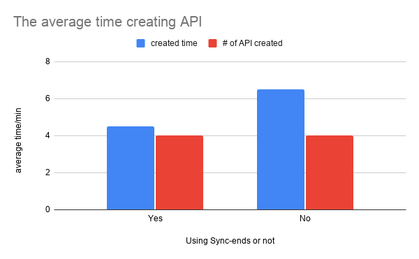
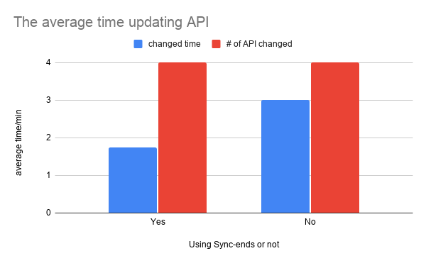
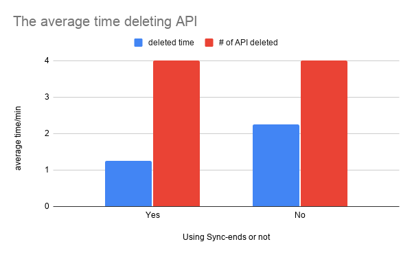
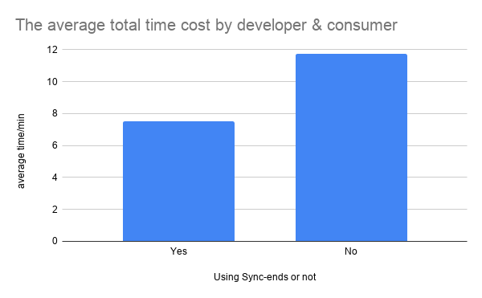

# Project 3 - Experiment Results

### Methods
Each experiment will involve 2 subjets:

* One person will act as API Developer
* 2nd person will act as API Consumer. (Also referred to as API Tester at some places)

In the experiment phase, we will be planning to evaluate the performance improvement of the API consumer (tester) in a rapidly developing environment. The experiment is planned to be run in pairs where one person will act as a developer and the other will act as an API consumer (tester).

* The job of the developer will be to change API schemas in Postman which mocks the behaviour that a change has been made in the serving of API in the actual codebase.
* The job of the tester will be to monitor these changes and note them down which mocks the behaviour that the API consumer is now aware that a change needs to be made in the codebase where this API is used.

The experiment will have two phases. (1) A pair of people NOT using our system and performing the experiment (2) The same pair of people now using our system and performing the experiment. This would ensure that the same group of people who experienced the absence can now, hopefully, understand the importance of the Sync Ends service and can benefit from it.

### Materials

* A slack workspace and a channel to receive the message of API changes.
* A postman sample collections to make API changes.
* Zoom meeting to conduct the experiment.
* Google Form to collect results.
* A timer to compute the time used by tester.
* Experiement Servey can be found [here](https://docs.google.com/document/d/15PUz_b4x4EqYdBk5F1nh2KZTbapiVmPjfnwp4cz4WrA/edit?usp=sharing)
* Experiment Data can be found [here](https://docs.google.com/spreadsheets/d/1EtSteNpQATWEDRM8Sj_o0lWYZ6gD86rTS48tmcWe8hE/edit?usp=sharing)

### Observations

1. API developer creates API and API consumer writes down the changes with or without using Sync-ends.
   
   
   
   The image above shows that testers using Sync-ends and not using Sync-ends are both creating 4 APIs and using Sync-ends will cost less time to create API 
   and write down changes.

2. API developer updates API and API consumer writes down the changes with or without using Sync-ends.
   
   
   
   The image above shows that testers using Sync-ends and not using Sync-ends are both updating 4 APIs and using Sync-ends will cost less time to update API
   and write down changes.

3. API developer deletes API and API consumer writes down the changes with or without using Sync-ends.
   
   

   The image above shows that testers using Sync-ends and not using Sync-ends are both deleting 4 APIs and using Sync-ends will cost less time to delete API
   and  write down changes.

4. The total time cost by API developer and API consumer with or without using Sync-ends.
   
   

   As we can see in the above graph, the average total time cost by API developer to create, update, and delete API using Sync-ends is much less than the time of group without using Sync-ends.

### Conclusions

1. Sync-ends can greatly reduce the time cost by synchronizing API changes between API developer and API consumer.
2. Most testers take more time on creating API than updating and deleting API.
3. As a result, we can say that API developer may find it is easier to use Sync-ends to synchronize API changes.

### Threats to Validity
* Insuffient Sample Size. The number of tester pairs is not enough, the experiment needs more tester to generate a more convincible result.
* Each pair of testers may have different time to get familiar with the Sync-Ends system, Postman platform and Slack app. We don't fully consider this situation in our experiment and we just assume that they are all familiar with these platforms.
* The concurrency of Sync-ends system may not be good. If multiple testers login to a same account and update API at a same time, the Sync-ends system may crash.
* We cannot assume that updating API changes is to write down API changes. In the real world, updating API changes needs developer to look into code and update it, not
  just copy and paste.